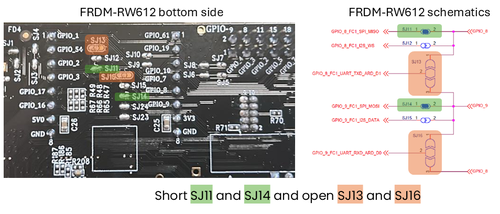
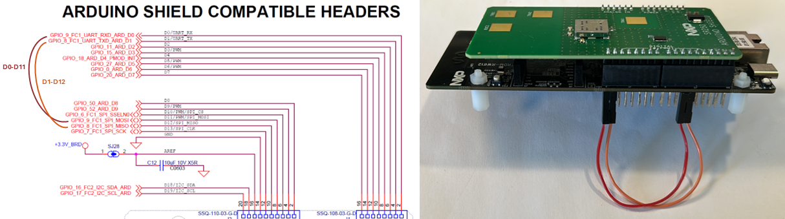

# Rework instruction to expose SPI interface on FRDM-RW612
In order to allow the SR250-ARD shield to communicate with the FRDM-RW612 board via SPI, a small rework is required to expose the SPI signals on the Arduino headers.

Alternatively you could simply interconnect FRMD-RW612 Arduino compatible header pins D0 to D11 and D1 to D12 via jumper wires.

