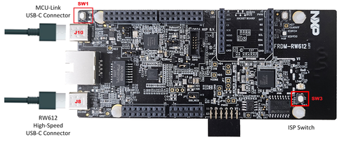
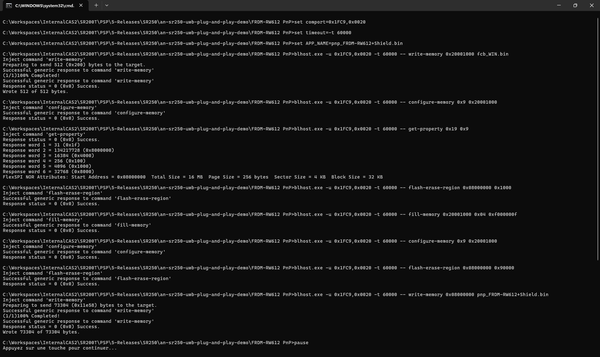
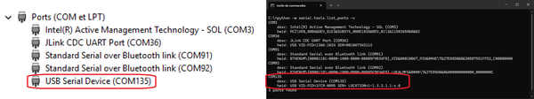
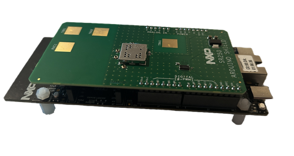
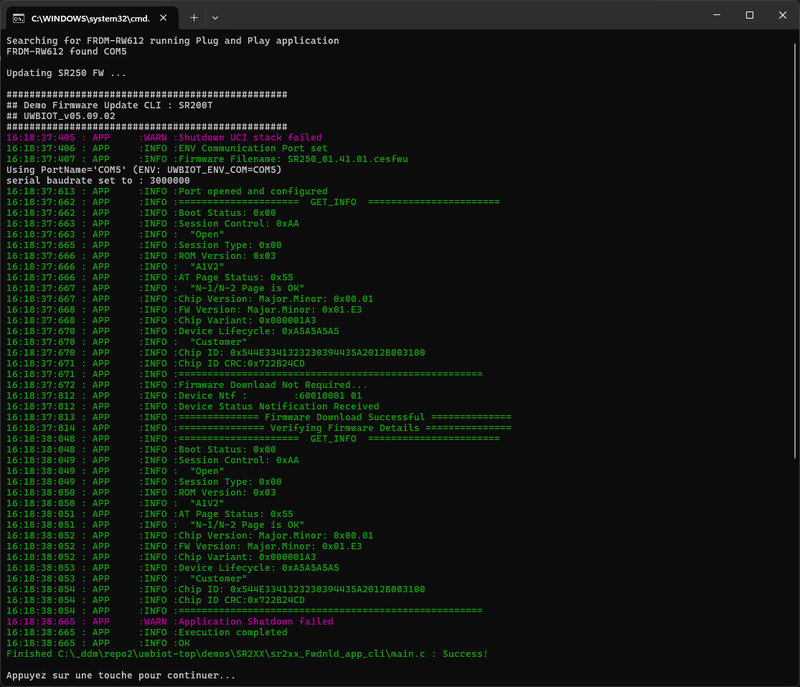
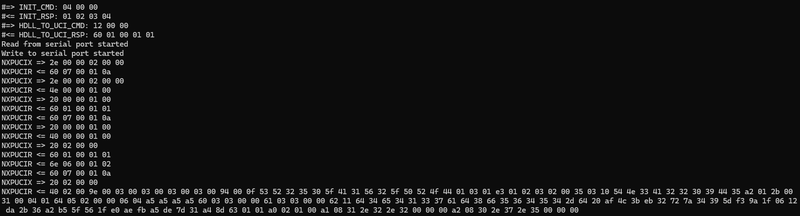
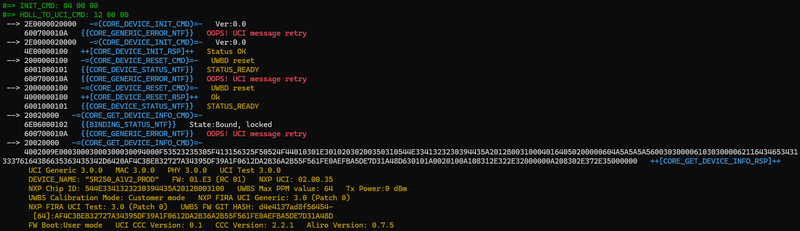

# NXP Application Code Hub
[](https://www.nxp.com)

## SR250 UWB Plug-and-Play Application  
### The Fastest Way to Explore, Prototype, and Validate UWB Scenarios from your laptop

This application provides the fastest and most intuitive way to start exploring UWB technology using the Plug-and-Play application. Designed to eliminate setup complexity, the application runs directly on the MCU and exposes the SR250 UCI interface through a Virtual COM port.

#### Boards: FRDM-RW612


---

## Table of Contents
1. [Software](#step1)
2. [Hardware](#step2)
3. [Setup](#step3)
4. [Demos](#step4)
5. [Support](#step5)
6. [Release Notes](#step6)

---

## 1. Software <a id="step1"></a>

You will need:

- **Python 3.x**
- **PySerial** (install with `pip install pyserial`)

---

## 2. Hardware <a id="step2"></a>

- [FRDM-RW612 Development Board](https://www.nxp.com/FRDM-RW612)  
  ⚠️ Requires a small rework because SPI is not exposed on the Arduino headers. See rework instruction [here](./FRDM-RW612_rework_for_SPI.md).

- [SR250-ARD Development Board](https://www.nxp.com/SR250UWBSHIELD)
- Windows PC
- Two USB-C cables (power + communication)

---

## 3. Setup preparation<a name="step3"></a>
### 3.1 Flashing Plug-and-Play application <a name="step3.1"></a>
First, flash the SR250 UWB Plug-and-Play application to the FRDM-RW612.



1. Connect two USB-C cables:
    - One to MCU-Link USB-C (J10)
    - One to High-Speed USB-C (J8)
2. Hold ISP button (SW3) → press & release Reset button (SW1) → release ISP button. The board is now in ISP over USB mode.
3. Run the flashing script from the application package:

```bash
FRDM-RW612_PnP/program_FRDM-RW612.bat
```



Once flashing is complete, disconnect and reconnect both USB-C cables to reboot the board. The FRDM-RW612 will enumerate as a Virtual COM port.
Identify the COM port using Device Manager or by running: `python -m serial.tools.list_ports -v`



### 3.2 Updating the SR250 Firmware
Before using the Python demo scripts, ensure that the SR250 firmware is up to date.
1. Assemble the SR250-ARD board on top of the FRDM-RW612.



2. Connect both USB-C cables to your computer.
3. Run the update script from the application package:

```bash
SR250_FW/Update_SR250_FW.bat
```



---

## 4. Demos<a name="step4"></a>

### 4.1 Overview
The Plug-and-Play package includes several Python-based demo scripts showcasing different UWB scenarios:
- ranging
- radar_ocpd
- radar_raw

Each demo communicates with the board through the SR250 UCI protocol using the detected COM port.

### 4.2 Execution
Demo scripts resides under *["Simple_demos"](./Simple_demos/)* folder. Run any demo using the following command:

```bash
python demo_<name>.py COM<X>
```

Where:
- `<name>` is one of: ranging, radar_ocpd, radar_raw
- `<X>` is the port identified in [section 3.1](#step3.1) (e.g., COM3)

The UCI exchanges will appear in the console output, allowing you to observe the real-time communication between the host and the SR250 device.



### 4.3 Demos details
#### 4.3.1 Ranging Demo
The ranging demo showcases how the SR250 can be configured to perform DS-TWR ranging with a peer UWB device. It requires two FRDM-RW612 boards with SR250-ARD shields, one configured as a controller and one as a controlee thanks to a parameter of the python script: `python demo_ranging.py COM<X> controller` or `python demo_ranging.py COM<X> controlee`.

#### 4.3.2 Radar OCPD Demo
The radar On-Chip Presence Detection demo showcases how the SR250 can be configured to report presence detection using its On-Chip Presence Detection (OCPD) feature. During execution, the OCPD UCI notification outputs are automatically recorded in *"radar_ocpd_results\\ocpd_results_xxx.csv"* file for further analysis.

#### 4.3.3 Radar Raw Demo
The radar raw demo showcases how the SR250 can be configured to capture UWB radar Channel Impulse Responses (CIRs). During execution, the CIR data are automatically recorded in *"radar_cirs\\radar_cirs_xxx.csv"* file for further post-processing.

### 4.4 UCI parsing
The viki perl parser helps to interpret the UCI exchanges. It requires Perl tool installed (min v5). run it as: 

```bash
python -u demo_<name>.py COM<X> | perl viki_SR250.pl
```

The UCI exchanges are interpreted 'live' as shown below:



---

## 5. Support<a name="step5"></a>
- Reach out to NXP Community page for more support - [NXP Community](https://community.nxp.com/)
- Learn more about SR250 UWB IC for Industrial IoT Ranging and Radar Applications - [Trimension® SR250](https://www.nxp.com/products/SR250)

#### Project Metadata

<!----- Boards ----->
[]()

<!----- Categories ----->
[](https://mcuxpresso.nxp.com/appcodehub?category=tools)

<!----- Peripherals ----->
[](https://mcuxpresso.nxp.com/appcodehub?peripheral=usb)

<!----- Toolchains ----->
[](https://mcuxpresso.nxp.com/appcodehub?toolchain=vscode)

Questions regarding the content/correctness of this example can be entered as Issues within this GitHub repository.

[](https://www.youtube.com/NXP_Semiconductors)
[](https://www.linkedin.com/company/nxp-semiconductors)
[](https://www.facebook.com/nxpsemi/)
[](https://x.com/NXP)

---

## 6. Release Notes<a name="step6"></a>
| Version | Description / Update                           | Date                        |
|:-------:|------------------------------------------------|----------------------------:|
| 1.0     | Initial release on Application Code Hub        | February 18<sup>th</sup> 2026 |
